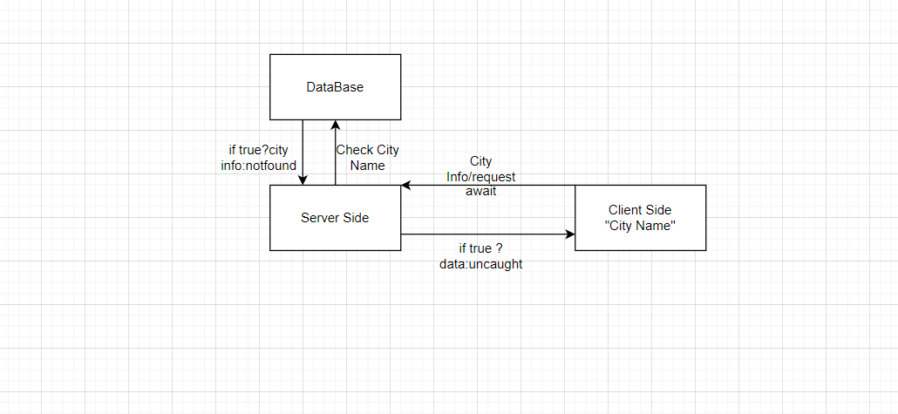
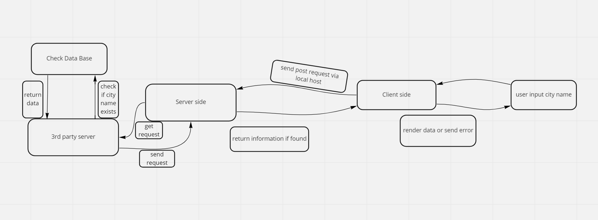

# Project Name

**Author**: Your Name Goes Here
**Version**: 1.0.0 (increment the patch/fix version number if you make more commits past your first submission)

# Class 7:

class 7

class 8

## Overview
<!-- Provide a high level overview of what this application is and why you are building it, beyond the fact that it's an assignment for this class. (i.e. What's your problem domain?) -->
We are building this application to allow people to search for different cities around the world with ease 
## Getting Started
<!-- What are the steps that a user must take in order to build this app on their own machine and get it running? -->
Our website is simple, search for the city you think about, we give you the information's we have 

## Architecture
<!-- Provide a detailed description of the application design. What technologies (languages, libraries, etc) you're using, and any other relevant design information. -->
We used react.js to buil this lovely website, we used bootstrap to make it cool

## Change Log
<!-- Use this area to document the iterative changes made to your application as each feature is successfully implemented. Use time stamps. Here's an example:

01-01-2001 4:59pm - Application now has a fully-functional express server, with a GET route for the location resource. -->

07-31-2022 4:59pm: added the ability to search for a city

07-31-2022 6:45pm:  added a component that displays the name and the exact location of the city

07-31-2022 7:35pm:  added the static map of the city

## Credit and Collaborations
<!-- Give credit (and a link) to other people or resources that helped you build this application. -->

I worked with my awesome college Omar Qattan, he was a big support to me and did our job at a good level

## Time Estimates Class 7

Name of feature: #3 react bootstrap, form, display

Estimate of time needed to complete: 8 hours

Start time: 1:00 pm

Finish time: 9:00 pm

Actual time needed to complete: 7 hours

## Time Estimates Class 8

Name of feature: #4 react bootstrap, form, display, axios

Estimate of time needed to complete: 5 hours

Start time: 6:00 pm

Finish time: 10:00 pm

Actual time needed to complete: 3 hours
